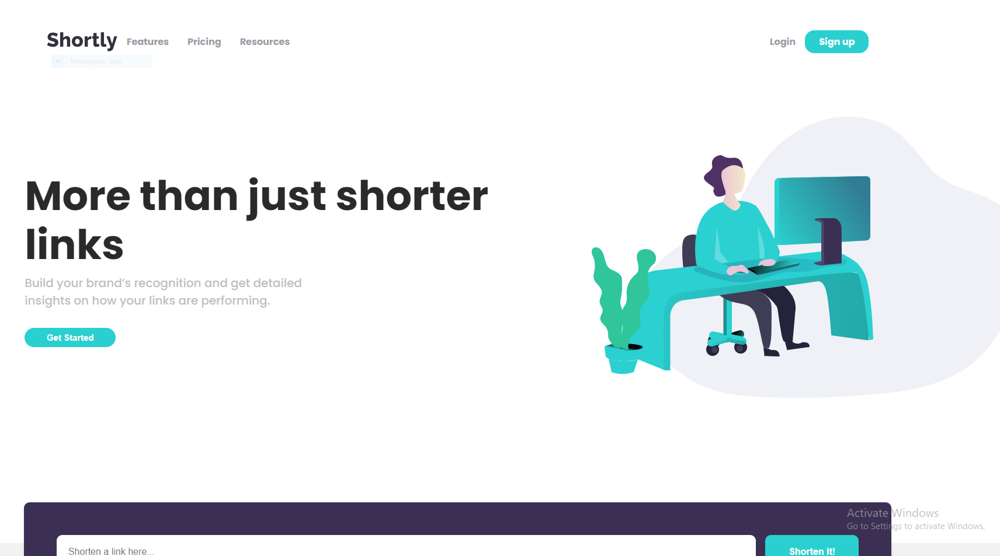

# Shortly URL Shortening API Challenge

This is a solution to the [Frontend Mentor Shortly URL shortening API Challenge](https://www.frontendmentor.io/challenges/url-shortening-api-landing-page-2ce3ob-G).

## Table of Contents

- [Overview](#overview)
- [Features](#features)
- [Getting Started](#getting-started)
- [Usage](#usage)
- [Technologies](#technologies)
- [Acknowledgments](#acknowledgments)

## Overview

Shortly is a web application that allows users to shorten long URLs and track their performance. It features a modern design and an easy-to-use interface, enhancing user experience while providing valuable insights into link usage.

## Features

- **Link Shortening:** Enter a URL and receive a shortened version.
- **Responsive Design:** Ensures the application works seamlessly on various devices.
- **Statistics Tracking:** Provides advanced statistics for each shortened link, including total clicks.
- **User Authentication:** Allows users to log in and save their shortened links for later reference.
- **Social Sharing:** Easy sharing of shortened links across social platforms.

## Usage

- **Shorten a Link:** Enter the URL you want to shorten and click the "Shorten It!" button.
- **View Statistics:** After shortening a link, view the link statistics in the statistics section.
- **Navigation:** Use the navigation menu to explore different sections of the website.

## Technologies

- **HTML5** for structuring the webpage.
- **CSS3** for styling and responsive design.
- **JavaScript** for client-side logic and handling API requests.
- **Google Fonts:** [Poppins](https://fonts.google.com/specimen/Poppins) for typography.

## Acknowledgments

- [Frontend Mentor](https://www.frontendmentor.io) for providing the challenge and design assets.
- [Icons8](https://icons8.com) for the GitHub icon used in the footer.

## Contributing

If you'd like to contribute to the Calculator project, please fork this repository and submit a pull request.

## License

This project is licensed under the MIT License. See the LICENSE.txt file for details.

## Contact
---------

If you have any questions or feedback, please don't hesitate to contact me at [peekaboo29266@gmail.com] or [[(https://github.com/Code2926)]].
